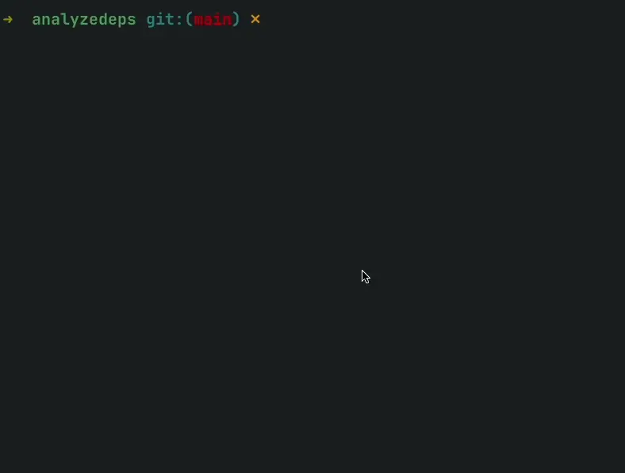

# Analyze Dependencies

Check usage of dependencies in your source code. Suggest removal of unused dependencies and update of outdated dependencies.

## Usage

```bash
npx analyze-dependencies
```



## License

See [LICENSE](LICENSE) file.

